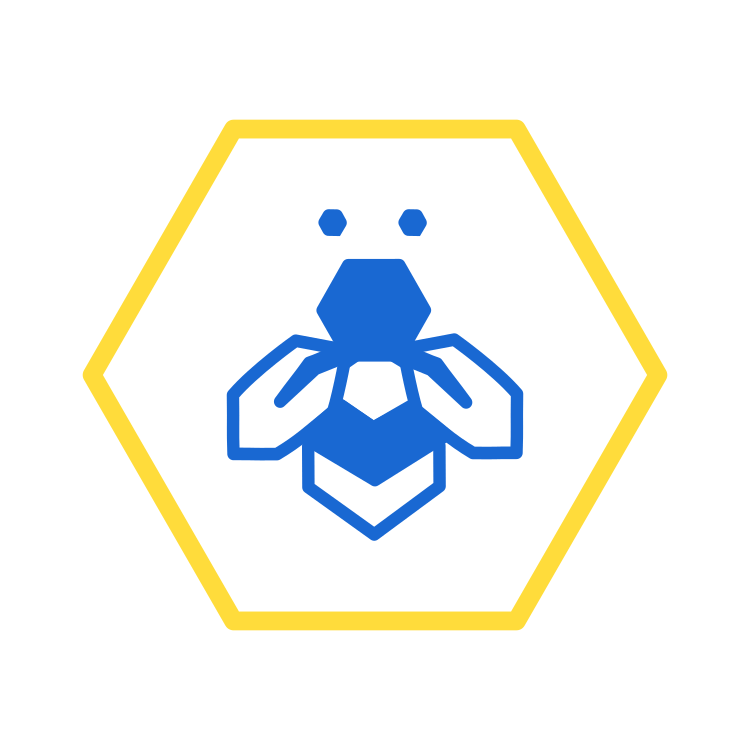

 

  

  <h3 align="center">Project Discord Bot</h3>

  

    A discord bot for assigning projects according to users interests.
     
     
    <a href="https://github.com/Catriix/ProBot"><strong>Explore the docs »</strong></a>
     
     
    <a href="https://github.com/Catriix/ProBot">View Demo</a>
    .
    <a href="https://github.com/Catriix/ProBot/issues">Report Bug</a>
    .
    <a href="https://github.com/Catriix/ProBot/issues">Request Feature</a>
  

    

## Table Of Contents

* [License](#license)
* [Authors](#authors)

## License

Distributed under the MIT License. See [LICENSE](https://github.com/Catriix/ProBot/blob/main/LICENSE.md) for more information.

## Authors

* **Catriix** - *FIT CTU* - [Catriix](https://github.com/Catriix) - **
